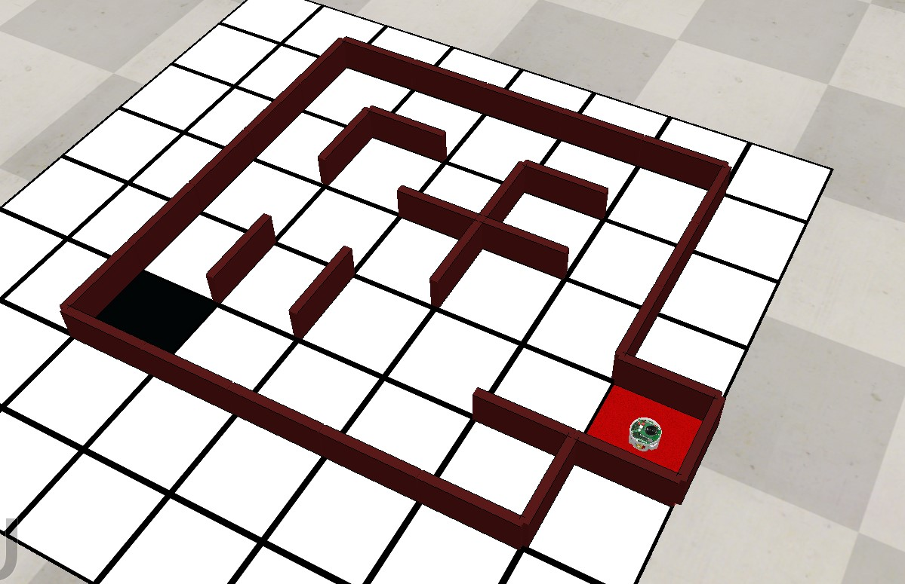

L'objectif de ce TP est de coder un robot arduino et de simuler son déplacement avec CoppeliaSim. Le robot a pour objectif de trouver une case noire sur le sol d'un labyrinthe et de rentrer à son point de départ (une case rouge).

Le but est d'atteindre cet objectif le plus rapidement possible.

